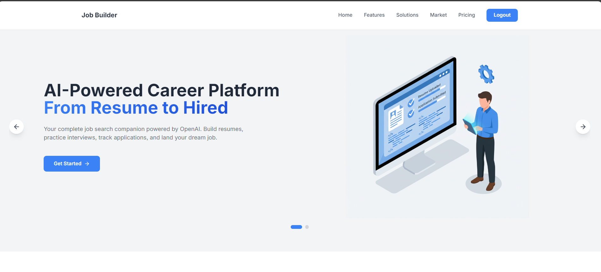
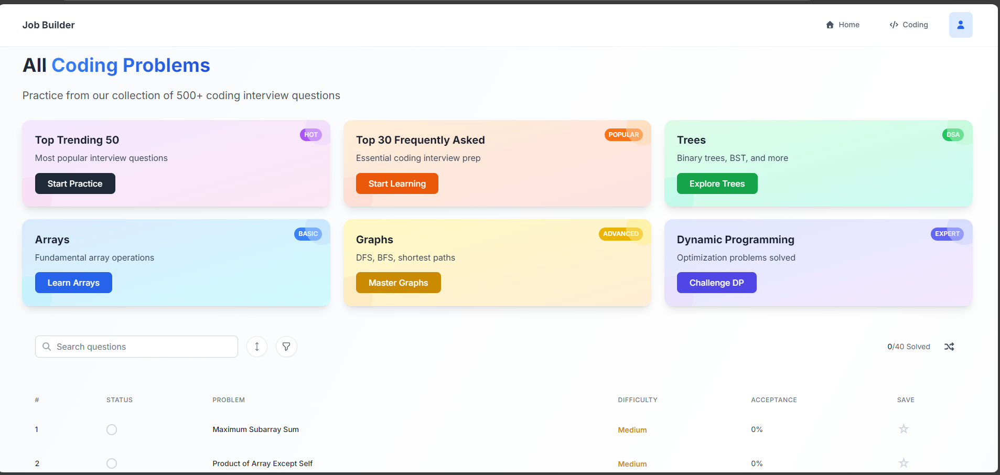
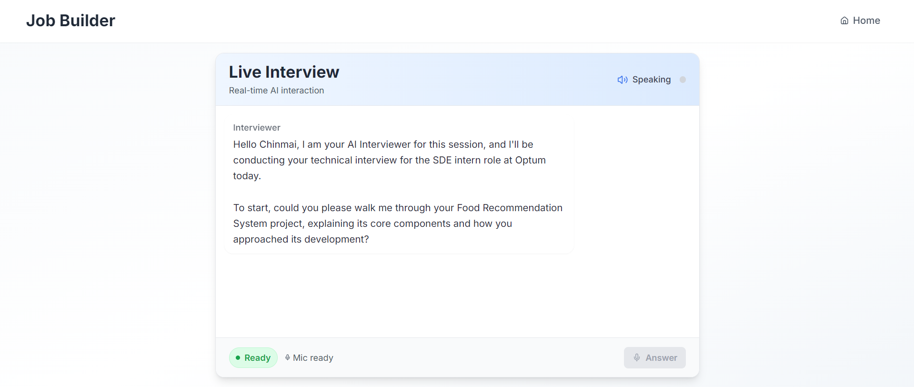
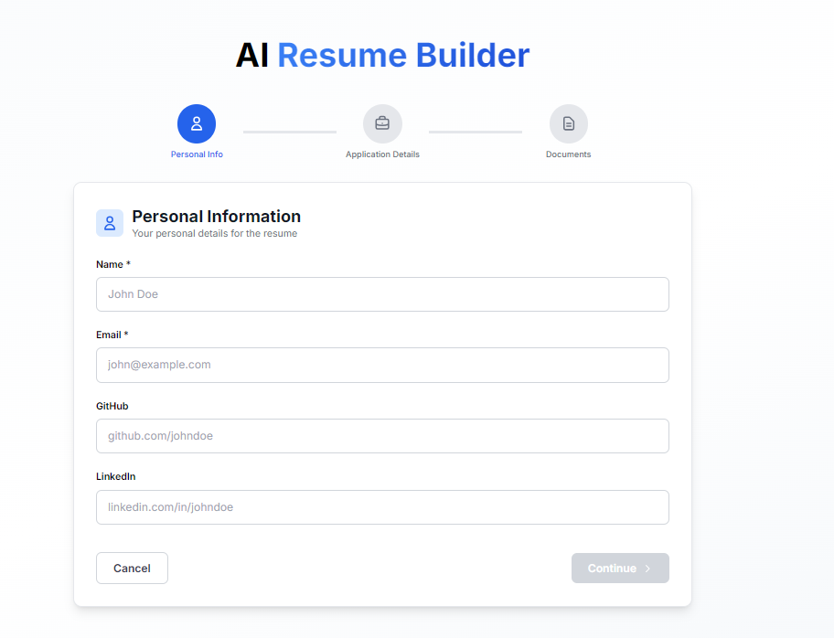
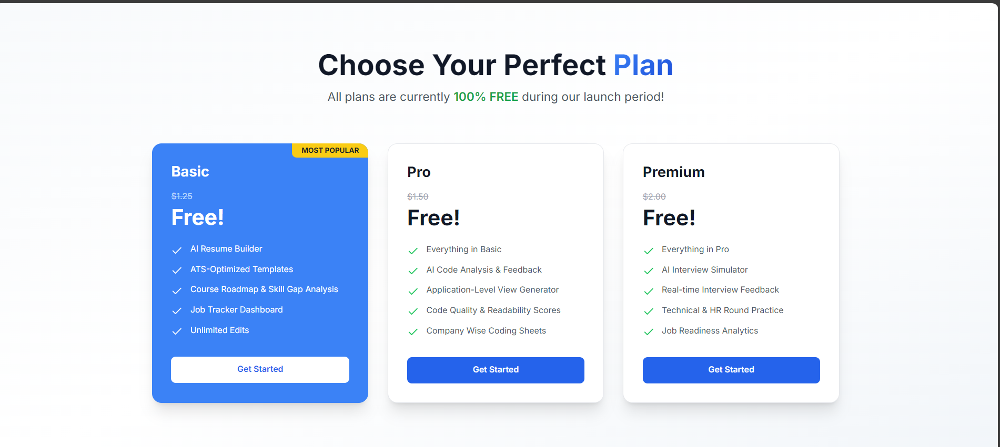

# 🚀 Job Securer - AI-Powered Interview Preparation Platform



> **Empowering job seekers with AI-driven coding practice, mock interviews, and career roadmap planning**


## 📸 Screenshots

### Coding Problems

*Practice curated DSA problems powered by AI:*
- **AI-Generated Application-Level Questions** - Real-world scenarios based on job descriptions
- **AI Assistant** - Get intelligent hints and explanations when stuck
- **AI Analysis on Each Run** - Instant code quality and efficiency feedback
- **AI Review & Feedback on Submit** - Detailed code review with optimization suggestions

### AI Mock Interview

*Real-time AI interviewer with voice interaction and detailed feedback*

### AI Resume Builder

*Generate ATS-friendly resumes with AI assistance*



---

## 🎯 Problem Statement

Job seekers, especially fresh graduates and career switchers, face multiple challenges:

### The Challenge
1. **Fragmented Resources**: Students juggle multiple platforms - LeetCode for coding, Pramp for interviews, resume builders, career advisors
2. **Lack of Personalization**: Generic practice without understanding individual strengths and weaknesses
3. **No Real Interview Experience**: Reading about interviews ≠ facing one
4. **Company-Specific Preparation Gap**: Difficult to find authentic company-specific questions and patterns
5. **High Cost**: Premium subscriptions across multiple platforms add up to $100+/month

### The Impact
- 📉 **68% of candidates** fail technical interviews due to lack of practice
- 💰 **Average student spends $150/month** on various prep platforms
- ⏰ **Inefficient preparation** leads to 6+ months of job search
- 😰 **High anxiety** from inadequate mock interview practice

---

## 💡 Our Solution: Job Securer

An **all-in-one AI-powered platform** that combines:

### 🎓 Comprehensive Features

#### 1. **Smart Coding Practice**
- 500+ curated Data Structures & Algorithms problems
- Difficulty-based progression (Easy → Medium → Hard)
- Topic-wise organization (Arrays, Trees, DP, etc.)
- Real-time code execution in 10+ languages
- AI-powered hints and explanations
- Detailed submission history and analytics

#### 2. **Company-Specific Preparation**
- **50+ top tech companies** including FAANG
- Authentic interview questions from each company
- Company-wise progress tracking
- Pattern recognition for company preferences
- Difficulty distribution analysis

#### 3. **AI Mock Interview Simulator**
- **Real-time voice interaction** with AI interviewer
- Two modes: **Technical** & **Behavioral**
- Natural conversation flow
- PDF resume and job description upload
- Instant performance report with:
  - Overall score (0-100)
  - Strengths and weaknesses
  - Actionable improvement tips
- Speech-to-text for natural responses

#### 4. **AI Resume Builder**
- ATS-optimized resume generation
- AI-powered content suggestions
- Multiple professional templates
- PDF export with one click
- Tailored to job descriptions

#### 5. **Career Roadmap Planner**
- Personalized learning paths
- Skill gap analysis
- Timeline-based milestones
- Resource recommendations
- Progress tracking

#### 6. **Advanced Analytics**
- Problem-solving statistics
- Streak tracking with calendar heatmap
- Topic-wise proficiency
- Difficulty-wise breakdown
- Submission history with code review

---

## 🏗️ Technical Architecture

### **Tech Stack**

#### Frontend
- **React 19** - UI Library
- **Vite** - Build Tool
- **Tailwind CSS** - Styling
- **React Router DOM** - Navigation
- **Monaco Editor** - Code Editor
- **Lucide React** - Icons
- **pdfjs-dist** - PDF Processing

#### Backend
- **Node.js** - Runtime
- **Express** - Web Framework
- **Supabase** - Database & Authentication
- **Google Gemini AI** - Interview Simulator & Code Analysis
- **ElevenLabs** - Text-to-Speech (optional)

#### Database
- **PostgreSQL (Supabase)** - Primary Database
- **Row Level Security** - Data Protection
- **Realtime Subscriptions** - Live Updates

#### Deployment
- **Vercel** - Frontend & Backend Hosting
- **GitHub** - Version Control
- **Environment Variables** - Secure Configuration

### **System Architecture**

```
┌─────────────────┐
│   React App     │
│   (Frontend)    │
└────────┬────────┘
         │
         │ HTTPS/REST
         │
┌────────▼────────┐
│  Express API    │
│   (Backend)     │
└────┬───┬───┬────┘
     │   │   │
     │   │   └──────┐
     │   │          │
┌────▼───▼────┐ ┌──▼─────────┐
│  Supabase   │ │ Gemini AI  │
│  PostgreSQL │ │   API      │
└─────────────┘ └────────────┘
```

---

## 📦 Project Structure

```
JOB-HELPER/
├── Frontend/                 # React Application
│   ├── src/
│   │   ├── components/      # Reusable components
│   │   ├── pages/           # Page components
│   │   ├── coding/          # Coding practice pages
│   │   ├── career/          # Career planning
│   │   ├── utils/           # Helper functions
│   │   └── assets/          # Images & static files
│   ├── public/              # Public assets
│   └── package.json         # Dependencies
│
├── Backend/                 # Express API
│   ├── routes/              # API routes
│   │   ├── auth.js         # Authentication
│   │   ├── companies.js    # Company data
│   │   ├── gemini.js       # AI integration
│   │   ├── interviewSimulator.js
│   │   ├── problemStatus.js
│   │   └── userStats.js
│   ├── config/             # Configuration
│   │   ├── supabase.js
│   │   └── supabaseAuth.js
│   └── package.json
│
├── Database/               # Database schemas
│   ├── models/            # SQL schemas
│   ├── migrations/        # Database migrations
│   └── queries/           # SQL queries
│
├── screenshots/           # Application screenshots
└── README.md             # This file
```

---

## 🚀 Getting Started

### Prerequisites
- Node.js 18+ installed
- Supabase account
- Google Gemini API key
- Git installed

### Environment Variables

#### Frontend `.env`
```env
VITE_SUPABASE_URL=your_supabase_url
VITE_SUPABASE_ANON_KEY=your_supabase_anon_key
VITE_GEMINI_API_KEY=your_gemini_api_key
VITE_API_BASE_URL=http://localhost:5000
```

#### Backend `.env`
```env
PORT=5000
SUPABASE_URL=your_supabase_url
SUPABASE_ANON_KEY=your_supabase_anon_key
GEMINI_API_KEY=your_gemini_api_key
FRONTEND_URL=http://localhost:5173
```

### Installation

1. **Clone the repository**
```bash
git clone https://github.com/CHINMAYBHT/OPENAI-BUILDATHON.git
cd OPENAI-BUILDATHON
```

2. **Setup Backend**
```bash
cd Backend
npm install
cp .env.example .env
# Edit .env with your credentials
npm start
```

3. **Setup Frontend**
```bash
cd Frontend
npm install
cp .env.example .env
# Edit .env with your credentials
npm run dev
```

4. **Setup Database**
```bash
cd Database
# Run SQL scripts in Supabase SQL Editor
# Execute files in models/ and migrations/
```

5. **Access the application**
- Frontend: http://localhost:5173
- Backend: http://localhost:5000

---

## 🎨 Key Features in Detail

### 1. Smart Code Editor
- **Syntax highlighting** for 10+ languages
- **Auto-completion** and IntelliSense
- **Real-time execution** with instant feedback
- **Test case validation** (Sample & Hidden)
- **AI-powered hints** when stuck
- **Code submission history** with time/space complexity

### 2. Progress Tracking
- **Streak calendar** - GitHub-style activity heatmap
- **Topic mastery** - Visualize strengths and weaknesses
- **Difficulty distribution** - Track Easy/Medium/Hard solved
- **Recent activity** - Last 10 submissions with details
- **Personal records** - Best submission times

### 3. AI Interview Simulator
**How it works:**
1. Upload resume (PDF) and job description
2. Choose interview mode (Technical/Behavioral)
3. AI interviewer asks relevant questions
4. Respond via voice or text
5. Get instant detailed feedback

**Evaluation Criteria:**
- Communication clarity
- Technical accuracy
- Problem-solving approach
- Behavioral responses (STAR method)
- Overall confidence

### 4. Company Insights
- Question frequency analysis
- Difficulty trends per company
- Recently asked questions
- Success rate statistics
- Interview process details

---

## 🔐 Security & Privacy

- ✅ **Row Level Security (RLS)** on all database tables
- ✅ **JWT-based authentication** via Supabase
- ✅ **Secure API endpoints** with user validation
- ✅ **CORS protection** for production
- ✅ **Environment variable encryption**
- ✅ **No sensitive data in Git history**

---

## 📊 Database Schema

### Core Tables
- `profiles` - User information
- `problems` - Coding problems with metadata
- `companies` - Tech companies data
- `company_problems` - Company-specific questions
- `user_problem_status` - User's problem attempts
- `user_streaks` - Activity tracking
- `user_languages` - Preferred programming languages
- `sheets` - Problem collections/categories

---

## 🌟 Innovation & Impact

### What Makes Us Different

1. **All-in-One Platform**: No need for multiple subscriptions
2. **AI-Powered Personalization**: Adaptive learning based on performance
3. **Real Voice Interaction**: Natural interview practice
4. **Company-Specific Data**: Authentic questions from real interviews
5. **Comprehensive Analytics**: Deep insights into progress

### Success Metrics (Target)
- 🎯 **50% reduction** in interview preparation time
- 💰 **$100+ savings** per month per user
- 📈 **80% interview success rate** for active users
- ⚡ **2x faster** skill development vs traditional methods

---

## 🛣️ Roadmap

### Phase 1 (Current) ✅
- Core coding practice platform
- Company-specific questions
- Basic AI mock interviews
- Progress tracking

### Phase 2 (Next 3 months) 🚧
- [ ] System Design interview prep
- [ ] Peer-to-peer mock interviews
- [ ] Mobile app (React Native)
- [ ] Advanced analytics dashboard
- [ ] Community forum

### Phase 3 (6 months) 📋
- [ ] Live coding sessions with mentors
- [ ] Job application tracker
- [ ] Salary negotiation simulator
- [ ] Interview scheduling integration
- [ ] Chrome extension for LeetCode sync

---

## 🤝 Contributing

We welcome contributions! Please follow these steps:

1. Fork the repository
2. Create a feature branch (`git checkout -b feature/AmazingFeature`)
3. Commit your changes (`git commit -m 'Add some AmazingFeature'`)
4. Push to the branch (`git push origin feature/AmazingFeature`)
5. Open a Pull Request

### Development Guidelines
- Follow ESLint configuration
- Write meaningful commit messages
- Add comments for complex logic
- Test thoroughly before PR
- Update documentation

---

## 📝 License

This project is licensed under the MIT License - see the [LICENSE](LICENSE) file for details.

---

## 👨‍💻 Author

**Chinmay Bhat**
- GitHub: [@CHINMAYBHT](https://github.com/CHINMAYBHT)
- Email: chin2006bhat@gmail.com

---

## 🙏 Acknowledgments

- **Google Gemini AI** for powering the interview simulator
- **Supabase** for backend infrastructure
- **Vercel** for seamless deployment
- **OpenAI Buildathon** for the opportunity
- All open-source contributors

---

## 📞 Support

- 📧 Email: chin2006bhat@gmail.com
- 🐛 Issues: [GitHub Issues](https://github.com/CHINMAYBHT/OPENAI-BUILDATHON/issues)
- 💬 Discussions: [GitHub Discussions](https://github.com/CHINMAYBHT/OPENAI-BUILDATHON/discussions)

---

## ⚡ Quick Links

- [Live Demo](https://openai-buildathon-rwjy.vercel.app)
- [API Documentation](https://openai-buildathon.vercel.app)
- [Database Schema](Database/models)
- [Deployment Guide](DEPLOYMENT.md)

---


**Made with ❤️ by Chinmay Bhat**

⭐ Star this repo if you find it helpful!

</div>
